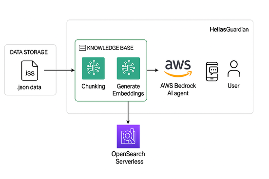
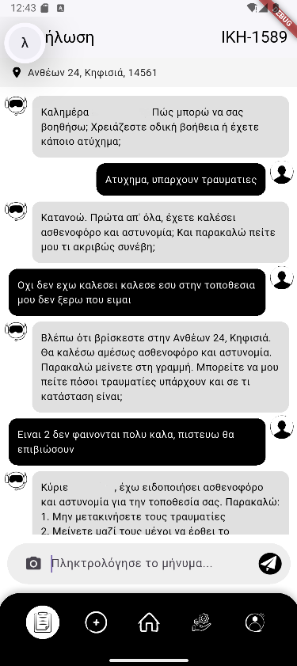
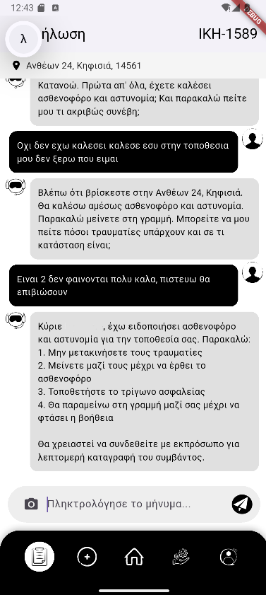

# AI-Powered Knowledge Retrieval Chatbot

## Overview

This project is an **AI-driven chatbot system** designed to retrieve and respond to user queries based on structured data. It leverages **AWS Bedrock Agents** for conversational intelligence and **OpenSearch Serverless** for semantic search over a vector-based knowledge base.

The system integrates multiple components — from data ingestion and chunking to embedding generation and real-time querying — to offer a powerful knowledge retrieval pipeline.

---

## Architecture Overview

The system architecture consists of the following key components:

### 1. **Data Ingestion**
- Source data is stored in `.json` format.
- These documents are processed into smaller logical units (**chunking**) for better semantic representation.

### 2. **Embedding Generation**
- Each chunk of content is transformed into a **vector embedding**.
- These embeddings are stored in **OpenSearch Serverless**, enabling efficient similarity-based retrieval.

### 3. **Knowledge Base Integration**
- The knowledge base acts as the foundation for the chatbot’s reasoning and answer generation.
- It is indexed and updated with the latest embeddings from the ingested documents.

### 4. **Conversational Interface**
- The user interacts with the system via a REST API built with **FastAPI**.
- Messages are sent to an **AWS Bedrock AI Agent**, which processes the input and generates contextual responses.
- The agent may optionally consult the OpenSearch index for relevant chunks before forming a response.

### 5. **Search & Response**
- The Bedrock agent fetches relevant embeddings via OpenSearch (if required), reasons over them, and returns a response to the user through the API.

    
---

## ⚙️ Technologies Used

| Component               | Technology                        |
|------------------------|------------------------------------|
| API Backend            | FastAPI (Python)                   |
| AI Agent               | AWS Bedrock Agent Runtime          |
| Vector Database        | Amazon OpenSearch Serverless       |
| Embedding Generation   | Integrated in Knowledge Base logic |
| Infrastructure         | AWS Cloud Services                 |
| SDK                    | Boto3 for AWS API integration      |

---

## 🚀 How It Works (Step-by-Step)

1. **User Query**: A user sends a message to the chatbot via a POST request to the API endpoint.
2. **Session Handling**: A session ID is generated (if not provided) to maintain context.
3. **Agent Invocation**: The message is passed to AWS Bedrock via the `invoke_agent` API call.
4. **Knowledge Retrieval**:
   - If necessary, the agent queries the OpenSearch Serverless store to retrieve contextually similar data chunks.
   - These chunks are retrieved based on vector similarity from the embedding index.
5. **Response Generation**: The agent uses the retrieved knowledge and generates a response.
6. **API Response**: The response is streamed back to the user through the API.

---

## Installation & Running

**Replace aws credentials with yours**

In [text](gateway-api-bedrock) main run: 

1) pip install fastapi boto3 uvicorn pydantic
2) uvicorn main:app --reload

In  main run:

1) flutter pub get
2) flutter run

---
## Examples 

 